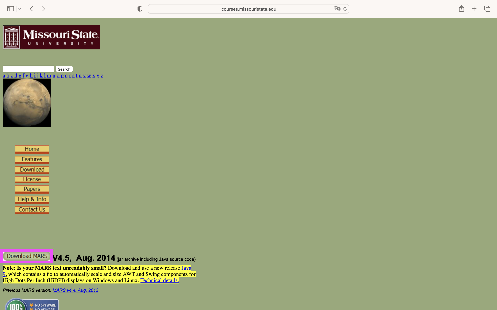
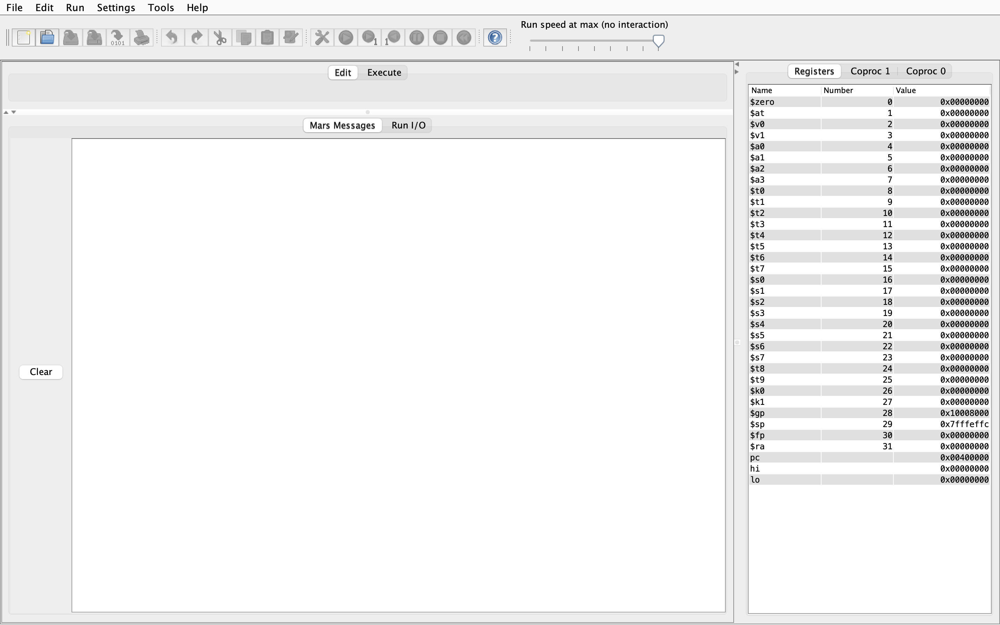
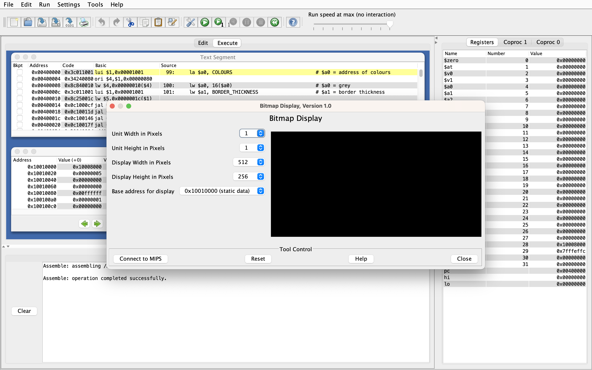
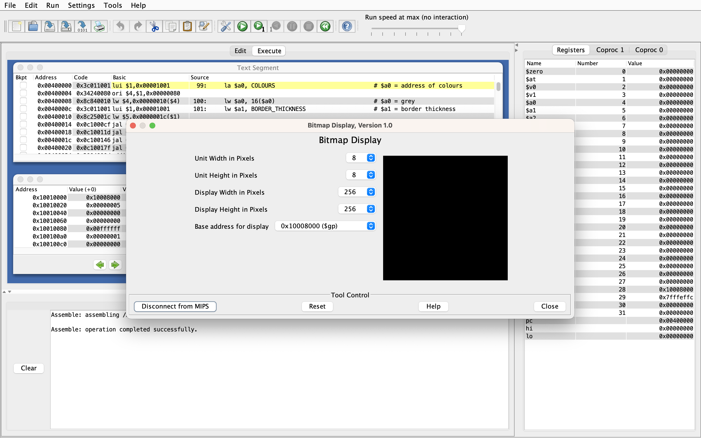
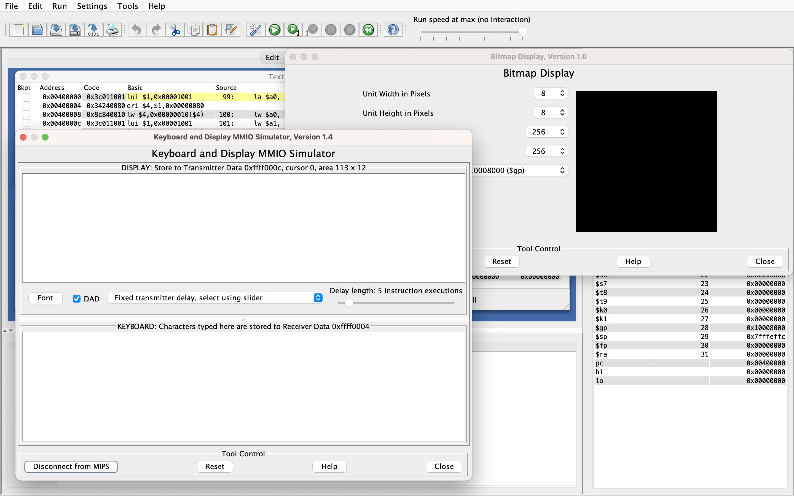
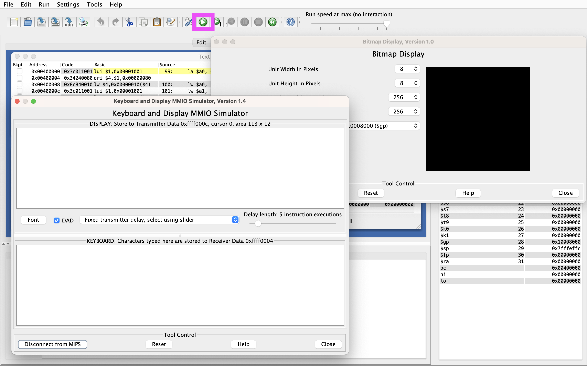
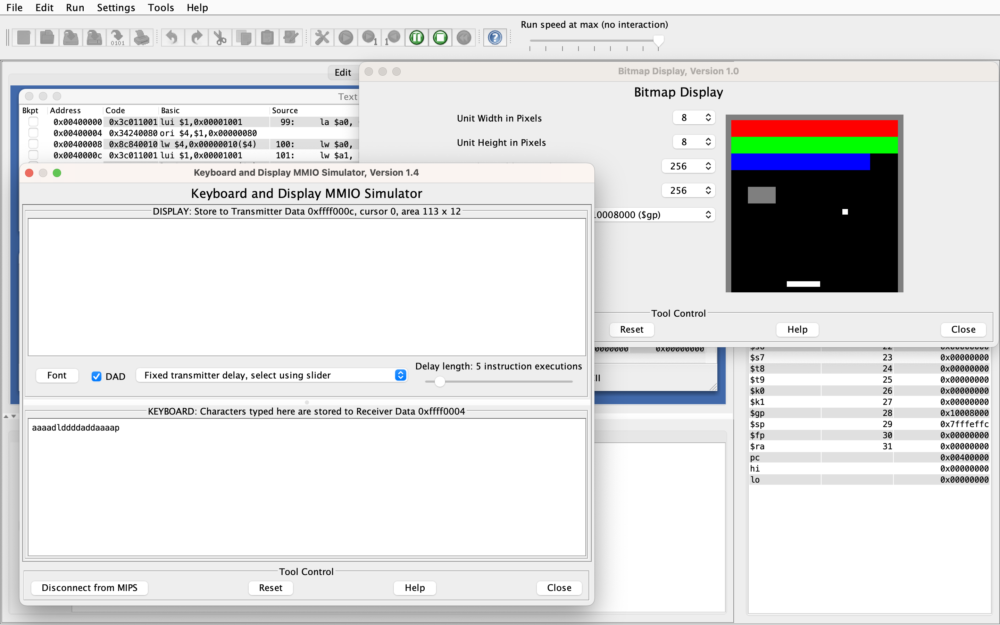
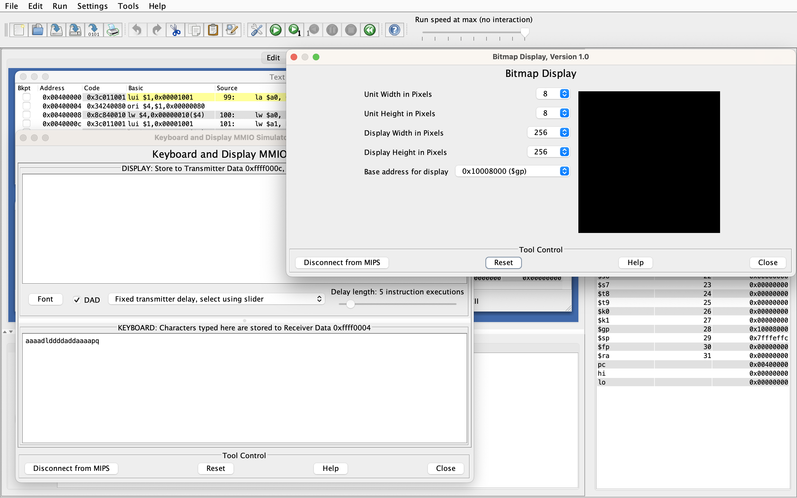
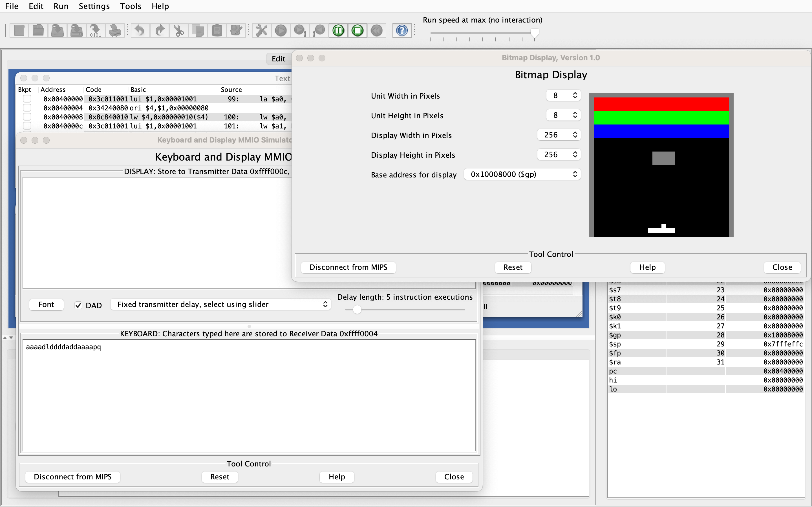

# Brick Breaker

This is a brick-breaking game created using MIPS Assembly. The game is run on [MARS](https://courses.missouristate.edu/KenVollmar/mars/index.htm), a MIPS Assembly simulator created by Pete Sanderson and Kenneth Vollmar of Missouri State University.

## Setup Instructions

### Downloading Software

This [link](https://courses.missouristate.edu/KenVollmar/mars/download.htm) opens the page shown below, where the 'Download MARS' button (boxed in magenta below) can be used to download MARS. Note that MARS is a `.jar` file and requires the installation of Java.

Successfully installing and opening MARS should bring up the following user interface.

### Starting the Game

Open `brick_breaker.asm` using the 'File' menu.

Under the 'Run' menu, select 'Assemble'.

Under the 'Tools' menu, select 'Bitmap Display'. This opens a bitmap display that will be used to show the game. The bitmap display opens with its default settings.

Change the bitmap display settings to the following:

* Unit Width in Pixels: `8`
* Unit Height in Pixels: `8`
* Display Width in Pixels: `256`
* Display Height in Pixels: `256`
* Base address for display: `0x10008000 ($gp)`

Finally, click the 'Connect to MIPS' button on the bottom-left corner of the bitmap display window. The bitmap display should now be fully configured.

Under the 'Tools' menu, select 'Keyboard and Display MMIO Simulator'. This opens a keyboard simulator window that allows MARS to detect keyboard inputs. On the bottom-left corner of this window, select 'Connect to MIPS'.

Finally, press the ▶️ button (boxed in magenta below) to start the game.

The game appears on the bitmap display.

Type in the keyboard simulator to control the game. For instructions on gameplay, see the **Gameplay** section of the README.

### Restarting the Game

To play again after the game has ended, press the ⏪ button (boxed in magenta below) to reset the program.

Next, click the 'Reset' button on the bitmap display. It should become fully black. Resetting the keyboard simulator is not required.

The game can now be restarted using the ▶️ button. Remember to type in the keyboard simulator to control the game.

## Gameplay

The main objective of the game is to use the ball to break all 18 bricks until none are remaining. The ball changes direction upon a collision with the paddle, the border, or any bricks.

If the ball reaches the bottom of the display, a life is lost. When three lives are lost, the player loses the game.

### Keyboard Controls

This game responds to the following keys:

* `a`: Move the paddle one unit to the left.
* `d`: Move the paddle one unit to the right.
* `l`: The ball automatically attaches itself to the paddle every time a new game starts or a life is lost. Pressing `l` launches the ball off the paddle so that it can begin breaking bricks.
* `p`: Pause the game. While paused, the game will not respond to the keys `a`, `d`, and `l`.
* `q`: Quit the game. This can be done even when the game is paused.

### Other Features

* Blue bricks take one hit to break, green bricks take two, and red bricks take three.
* Breaking a red brick for the first time during each life causes the ball to double its speed. The ball resets its speed when a life is lost.
* A grey unbreakable brick will spawn in a random location every time a new game begins. This brick is not one of the 18 bricks that the player needs to break to win.
* The border turns green when the game is won and red when the game is lost.

### Tips

* The ball always moves diagonally.
* The ball moves to the left when it hits the left side of the paddle and to the right when it hits the right side of the paddle.
* Hitting more red bricks after a red brick has already been hit does not change the speed of the ball as long as no lives are lost.
* MARS may freeze if keys are pressed too fast. If this happens, restart MARS.
